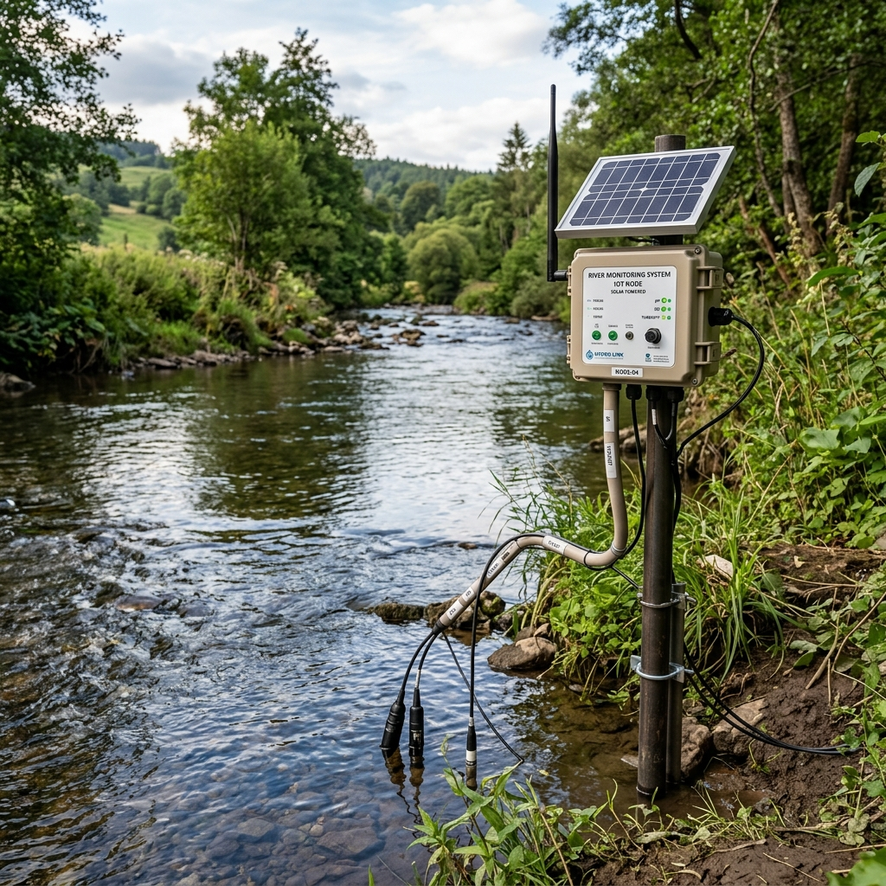
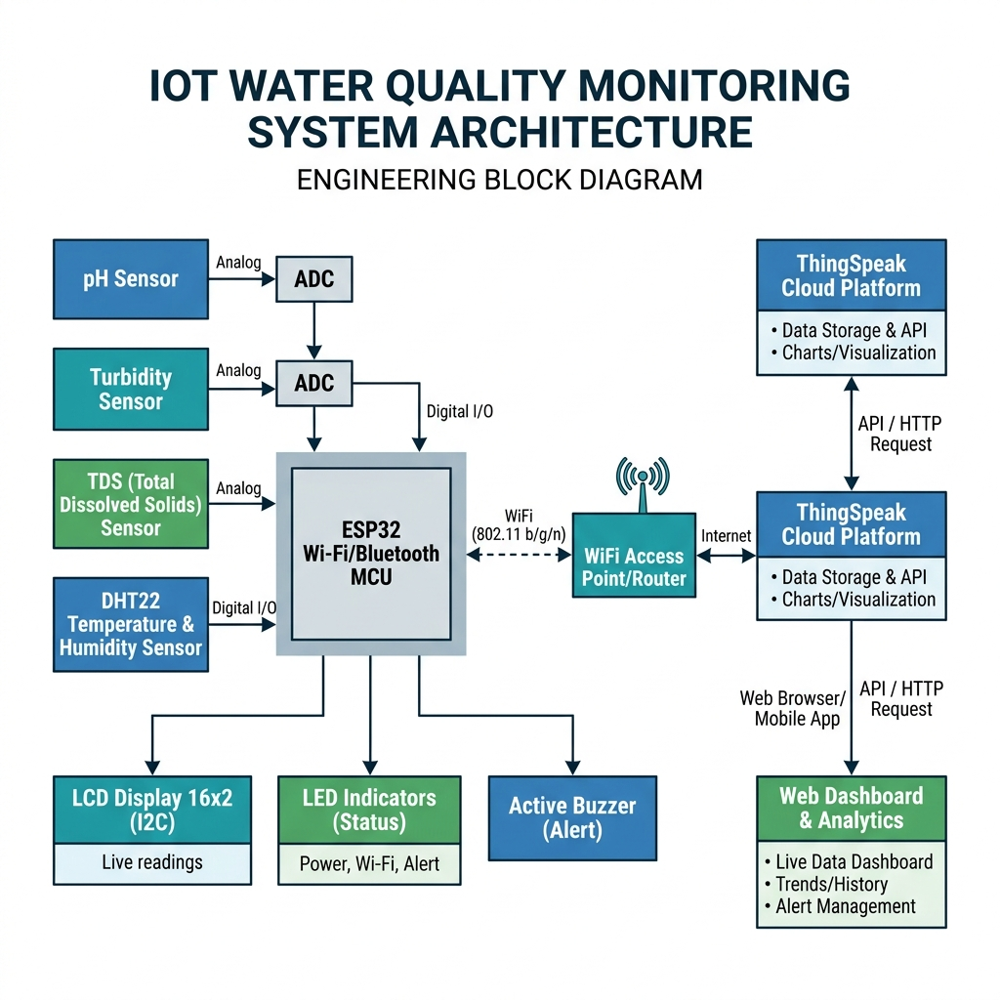
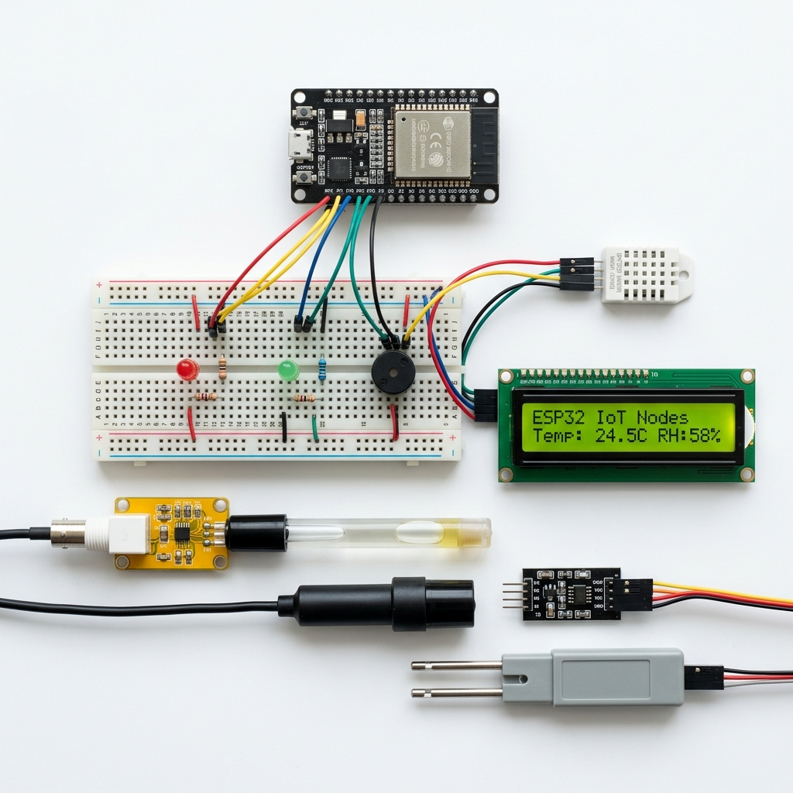
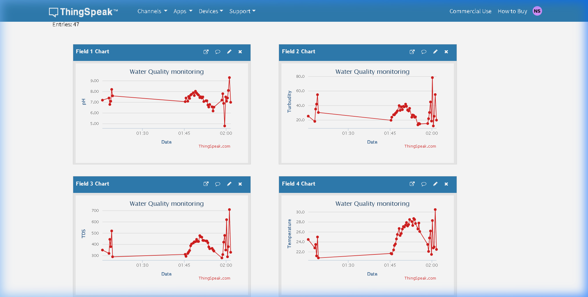
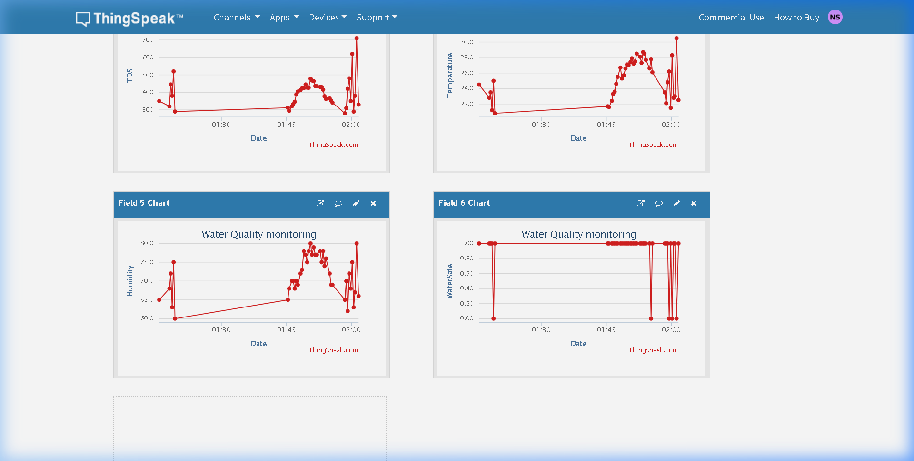
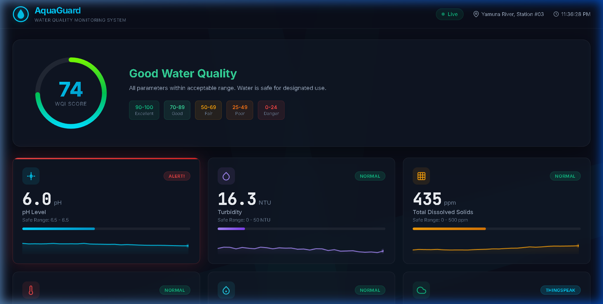
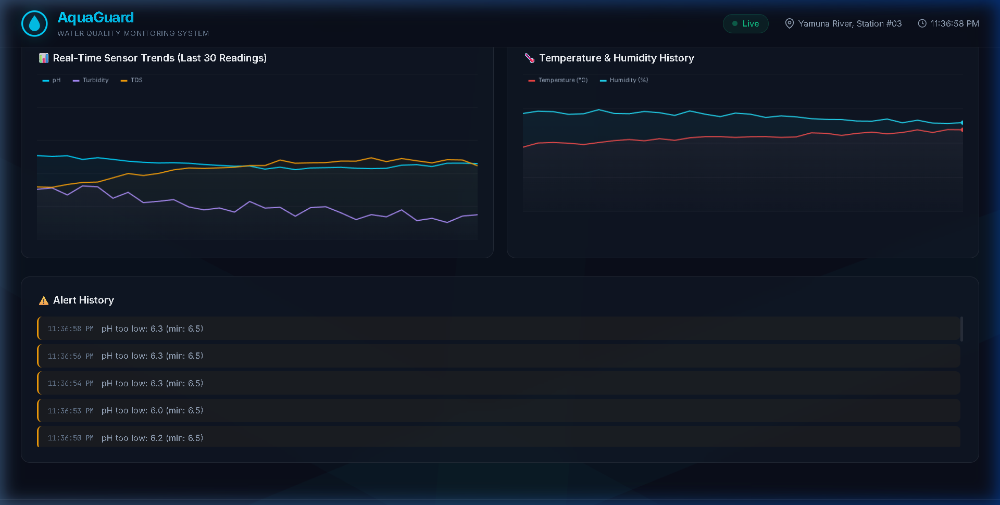

# 🌊 IoT-Based River & Lake Water Quality Monitoring System

> Real-time water quality monitoring using ESP32, multiple sensors, ThingSpeak cloud integration, and a custom web dashboard.



## 📋 Overview

This project implements a complete IoT-based water quality monitoring system designed for rivers and lakes. It uses an **ESP32 microcontroller** to read data from multiple water quality sensors, displays readings on an LCD, triggers alerts for unsafe water, and uploads all data to the **ThingSpeak cloud platform** for remote monitoring and visualization.

A custom-built **AquaGuard Web Dashboard** provides real-time visualization with Water Quality Index (WQI) scoring, trend charts, and alert logging.

## 🏗️ System Architecture



## ⚙️ Components Used

| Component | Purpose | Pin Connection |
|-----------|---------|----------------|
| ESP32 DevKit V1 | Main controller (WiFi + Processing) | - |
| DHT22 Sensor | Temperature & Humidity | GPIO 4 |
| pH Sensor (Analog) | Water acidity/alkalinity (0-14 pH) | GPIO 34 (ADC) |
| Turbidity Sensor (Analog) | Water clarity (0-100 NTU) | GPIO 35 (ADC) |
| TDS Sensor (Analog) | Dissolved solids (0-1000 ppm) | GPIO 32 (ADC) |
| LCD 16x2 (I2C) | Local data display | GPIO 21 (SDA), GPIO 22 (SCL) |
| Green LED | Safe water indicator | GPIO 25 |
| Red LED | Danger/Alert indicator | GPIO 26 |
| Active Buzzer | Audible alarm | GPIO 27 |



## 🔧 Project Structure

```
water_monitoring/
├── wokwi/                          # Wokwi Simulation Files
│   ├── sketch.ino                  # ESP32 Arduino firmware
│   ├── diagram.json                # Circuit diagram for Wokwi
│   └── libraries.txt               # Required libraries
├── dashboard/                      # Web Dashboard (AquaGuard)
│   ├── index.html                  # Dashboard HTML
│   ├── style.css                   # Dark theme CSS (glassmorphism)
│   └── dashboard.js                # Real-time data visualization JS
├── images/                         # Project images & screenshots
│   ├── deployment.png              # IoT node deployment photo
│   ├── architecture.png            # System block diagram
│   ├── components.png              # Hardware components layout
│   ├── methodology.png             # Methodology flowchart
│   ├── thingspeak_real_top.png     # Real ThingSpeak data (pH, Turbidity)
│   ├── thingspeak_real_bottom.png  # Real ThingSpeak data (TDS, Temp, Humidity, Safe)
│   ├── dashboard_main.png          # AquaGuard dashboard screenshot
│   ├── dashboard_charts.png        # Dashboard charts & alerts
│   ├── simulation_with_api.png     # Wokwi simulation running
│   └── simulation_full.png         # Full circuit view
├── Water_Quality_Monitoring_IoT_FINAL.pptx  # Project Presentation (19 slides)
└── README.md                       # This file
```

## 🚀 How to Run

### 1. Wokwi Simulation (No Hardware Required)

1. Go to [wokwi.com](https://wokwi.com/projects/new/esp32)
2. Replace `sketch.ino` content with the code from `wokwi/sketch.ino`
3. Switch to `diagram.json` tab and paste content from `wokwi/diagram.json`
4. Add libraries: `LiquidCrystal I2C` and `DHT sensor library for ESPx`
5. Click **Start Simulation** ▶️
6. Adjust potentiometers to simulate different water conditions

### 2. Web Dashboard

1. Open `dashboard/index.html` in any modern browser
2. The dashboard auto-generates simulated data for demonstration
3. Features: WQI score, sensor cards with sparklines, trend charts, alert log

### 3. Hardware Implementation

Flash `wokwi/sketch.ino` to a real ESP32 using Arduino IDE:
- Install Arduino IDE → Add ESP32 board support
- Install libraries: `LiquidCrystal I2C`, `DHT sensor library for ESPx`
- Update WiFi credentials in the code
- Upload and connect sensors as per the pin table above

## ☁️ Cloud Integration (ThingSpeak)

- **Platform**: [ThingSpeak](https://thingspeak.com) by MathWorks
- **Channel ID**: 3323035
- **Data Fields**:
  - Field 1: pH Level
  - Field 2: Turbidity (NTU)
  - Field 3: TDS (ppm)
  - Field 4: Temperature (°C)
  - Field 5: Humidity (%)
  - Field 6: Water Safe Status (1=Safe, 0=Danger)
- **Update Interval**: Every 15 seconds
- **Total Entries**: 47+ (with both SAFE and DANGER readings)

### Real ThingSpeak Data

| pH & Turbidity Charts | TDS, Temp, Humidity & Safety Charts |
|:---:|:---:|
|  |  |

## 📊 Results

| Parameter | Measured Range | WHO Safe Limit | Status |
|-----------|---------------|----------------|--------|
| pH Level | 4.8 - 9.3 | 6.5 - 8.5 | ⚠️ 3 Alerts |
| Turbidity | 12.0 - 78.5 NTU | < 50 NTU | ⚠️ 1 Alert |
| TDS | 280 - 710 ppm | < 500 ppm | ⚠️ 2 Alerts |
| Temperature | 20.8 - 30.5 °C | 5 - 35 °C | ✅ Normal |
| Humidity | 60 - 80% | 30 - 80% | ✅ Normal |
| Water Safety | 0/1 | 1 (Safe) | 41 Safe, 6 Danger |

## 📱 Dashboard Screenshots

| AquaGuard Dashboard | Charts & Alert Log |
|:---:|:---:|
|  |  |

## 🔮 Future Scope

- Dissolved Oxygen (DO) and BOD sensors for comprehensive analysis
- Machine Learning for predictive water quality forecasting
- Solar-powered stations with LoRaWAN for remote deployment
- Mobile app with push notifications
- Integration with government water quality databases (CPCB/SPCB)

## 💰 Estimated Hardware Cost

| Category | Cost (₹) |
|----------|----------|
| ESP32 DevKit V1 | ₹500 |
| Sensors (pH + Turbidity + TDS + DHT22) | ₹1,500 |
| Output (LCD + LEDs + Buzzer) | ₹200 |
| Misc (Breadboard, Wires, Power) | ₹500 |
| **Total** | **~₹2,700** |

## 📚 References

1. S. Pasika & S. T. Gandla, "Smart water quality monitoring system using IoT," *Heliyon*, 2020.
2. S. Geetha & S. Gouthami, "IoT enabled real time water quality monitoring," *Smart Water*, 2017.
3. ESP32 Technical Reference - Espressif Systems
4. ThingSpeak IoT Platform - MathWorks
5. WHO Guidelines for Drinking-water Quality, 4th Edition, 2017.

## 📄 License

This project is for academic/educational purposes.

---

**Built with** ❤️ **using ESP32, ThingSpeak, HTML/CSS/JS**
